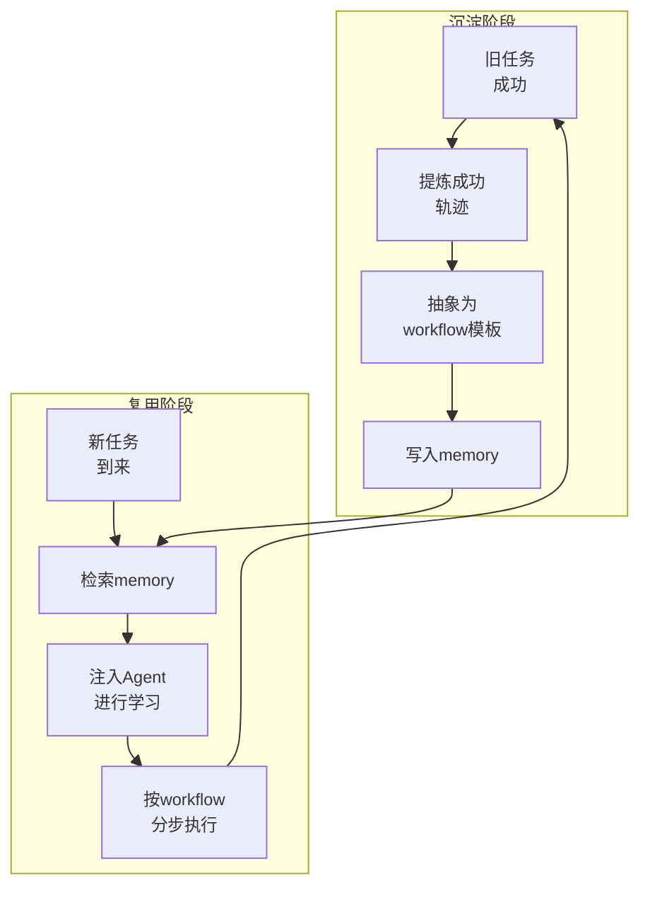

# LeafBot

一个轻量、可扩展的个人 AI 助手框架。  
支持 CLI 对话、定时任务、文件读写、网页搜索与多渠道接入（Telegram / Discord / WhatsApp / Feishu / Slack 等）。

LeafBot拥有语义+事件+技能三层记忆框架，其中专门设计的 **skill-memory（技能记忆）** 能让 Agent 学习历史成功工作流，提高复杂任务成功率，让 Agent 更果断、更低延迟、更低 API 成本。

skill-memory 的核心闭环：

1. 旧任务成功后，提炼可复用 workflow 并写入 memory。  
2. 新任务到来时，检索 memory 注入 Agent 进行学习，再按步骤执行并继续沉淀。




## 安装

### 方式 1：开发模式（推荐）

```bash
git clone https://github.com/maple0leaves/LeafBot.git
cd LeafBot
pip install -e .
```

### 方式 2：PyPI

```bash
pip install leafbot-ai
```

## 快速开始

### 1) 初始化

```bash
leafbot onboard
```

首次运行会生成配置文件：`~/.leafbot/config.json`

### 2) 配置模型

最小可用示例（OpenRouter）：

```json
{
  "providers": {
    "openrouter": {
      "apiKey": "sk-or-v1-xxx"
    }
  },
  "agents": {
    "defaults": {
      "model": "anthropic/claude-opus-4.5",
      "provider": "openrouter"
    }
  }
}
```

### 3) 开始使用

```bash
leafbot agent
```

## 常用命令

```bash
leafbot status                 # 查看状态
leafbot agent                  # 终端对话
leafbot gateway                # 启动网关（接入聊天渠道）
leafbot channels status        # 查看渠道配置状态
leafbot cron add --name demo --message "daily report" --cron "0 9 * * *" --tz "Asia/Shanghai"
```

## 接入 Telegram

### 1) 创建 Bot

- 在 Telegram 搜索并打开 `@BotFather`
- 发送 `/newbot`，按提示完成创建
- 记录返回的 `bot token`

### 2) 获取你的用户 ID

- 可使用 `@userinfobot`（或任意 user id 查询机器人）获取你的 Telegram user id
- 将该 id 填到 `allowFrom`，避免被陌生人调用

### 3) 配置 `~/.leafbot/config.json`

```json
{
  "channels": {
    "telegram": {
      "enabled": true,
      "token": "YOUR_BOT_TOKEN",
      "allowFrom": ["YOUR_USER_ID"]
    }
  }
}
```

### 4) 启动网关

```bash
leafbot gateway
```

可先用下面命令检查渠道是否启用成功：

```bash
leafbot channels status
```

## Docker

```bash
docker build -t leafbot .
docker run -v ~/.leafbot:/root/.leafbot --rm leafbot onboard
docker run -v ~/.leafbot:/root/.leafbot -p 18790:18790 leafbot gateway
```

或使用 `docker-compose.yml`：

```bash
docker compose up -d leafbot-gateway
```

## 项目结构（简版）

```text
leafbot/
├── agent/        # Agent 主循环与工具调度
├── cli/          # 命令行入口
├── channels/     # 各聊天渠道适配
├── config/       # 配置加载与 schema
├── cron/         # 定时任务
├── providers/    # LLM 提供商适配
├── session/      # 会话与历史
└── templates/    # 工作区模板
```

---

## 参考：

[nanobot](https://github.com/HKUDS/nanobot)

[ICML2025 Paper Agent Workflow Memory](https://icml.cc/virtual/2025/poster/45496)