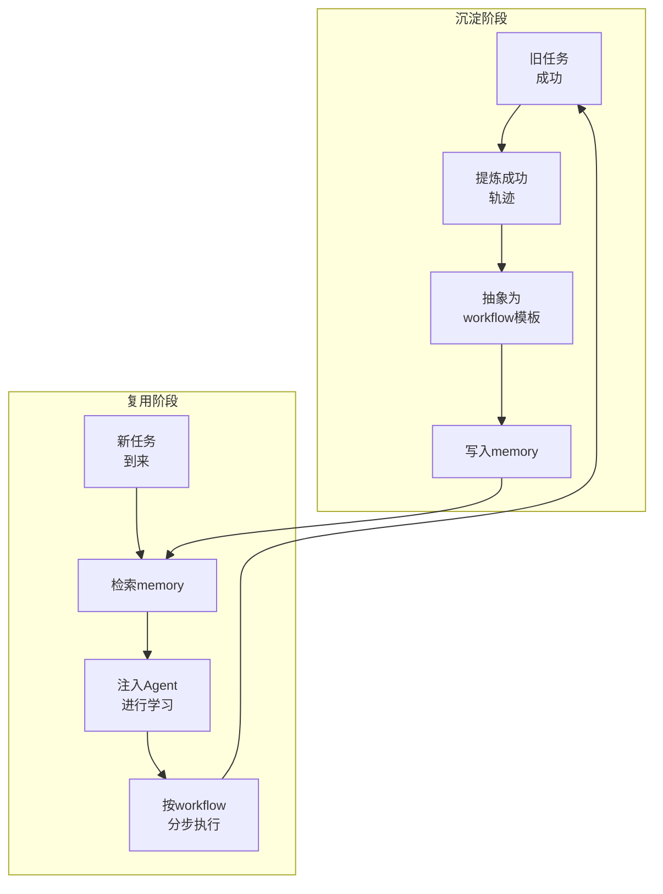

# LeafBot

一个轻量、可扩展的个人 AI 助手框架。  
支持 CLI 对话、定时任务、文件读写、网页搜索与多渠道接入（Telegram / Discord / WhatsApp / Feishu / Slack 等）。

LeafBot拥有语义+事件+技能三层记忆框架，其中专门设计的 **skill-memory（技能记忆）** 能让 Agent 学习历史成功工作流，提高复杂任务成功率，让 Agent 更果断、更低延迟、更低 API 成本。

skill-memory 的核心闭环：

1. 旧任务成功后，提炼可复用 workflow 并写入 memory。
2. 新任务到来时，检索 memory 注入 Agent 进行学习，再按步骤执行并继续沉淀。


## 结构
```
用户消息
  │
  ▼
┌──────────────────┐
│ Channels (10+)   │  Telegram/Discord/Slack/飞书/钉钉/...
│ → InboundMessage │
└────────┬─────────┘
         │
         ▼
┌──────────────────┐
│   MessageBus     │  asyncio.Queue（inbound + outbound）
└────────┬─────────┘
         │
         ▼
┌──────────────────────────────────────────────┐
│              AgentLoop                        │
│                                               │
│  ContextBuilder 组装 Prompt                    │
│  ├── System Prompt (Identity + Bootstrap)     │
│  ├── Memory (MEMORY.md + SKILLS.jsonl 检索)   │
│  ├── History (Session 历史)                    │
│  └── User Message                             │
│                                               │
│  ReAct 循环:                                   │
│  while not done:                              │
│    LLM.chat() → tool_calls? → execute tools   │
│                → text?      → 返回最终结果      │
│                                               │
│  Session 保存 + Memory Consolidation 触发      │
└────────┬─────────────────────┬────────────────┘
         │                     │
         ▼                     ▼
┌────────────────┐   ┌──────────────────┐
│ Tools (8+)     │   │ SubagentManager  │
│ file/shell/web │   │ spawn 子 Agent    │
│ mcp/cron/...   │   │ 后台执行→回报结果  │
└────────────────┘   └──────────────────┘
         │
         ▼
┌──────────────────┐
│   MessageBus     │  OutboundMessage
└────────┬─────────┘
         │
         ▼
┌──────────────────┐
│ Channels (10+)   │  回复到对应平台
└──────────────────┘
```


## 目录
```
LeafBot/
├── pyproject.toml                    # 项目依赖 & 打包配置（hatchling）
├── README.md                         # 项目说明
├── Dockerfile / docker-compose.yml   # 容器化部署
│
├── leafbot/                          # ===== 核心 Python 包 =====
│   ├── **init**.py
│   ├── **main**.py                   # python -m leafbot 入口
│   │
│   ├── agent/                        # 🧠 Agent 核心（最重要的层）
│   │   ├── loop.py                   #   主 Agent 循环（ReAct）
│   │   ├── context.py                #   Prompt 组装（System + Memory + Skills + History）
│   │   ├── memory.py                 #   三层记忆（MEMORY.md / HISTORY.md / SKILLS.jsonl）
│   │   ├── skills.py                 #   Skills 加载器（builtin + workspace）
│   │   ├── subagent.py               #   子 Agent 管理器
│   │   └── tools/                    #   工具层
│   │       ├── base.py               #     Tool 抽象基类
│   │       ├── registry.py           #     工具注册中心
│   │       ├── filesystem.py         #     read/write/edit/list 文件操作
│   │       ├── shell.py              #     exec 命令执行
│   │       ├── web.py                #     web_search + web_fetch
│   │       ├── message.py            #     回复用户消息
│   │       ├── spawn.py              #     创建子 Agent
│   │       ├── cron.py               #     定时任务管理
│   │       └── mcp.py                #     MCP 协议工具动态加载
│   │
│   ├── bus/                          # 📨 消息总线（解耦层）
│   │   ├── events.py                 #   InboundMessage / OutboundMessage 数据结构
│   │   └── queue.py                  #   MessageBus（两个 asyncio.Queue）
│   │
│   ├── channels/                     # 📱 多平台适配器（10+ 渠道）
│   │   ├── base.py                   #   Channel 抽象基类
│   │   ├── manager.py                #   ChannelManager（统一管理所有渠道）
│   │   ├── telegram.py               #   Telegram
│   │   ├── discord.py                #   Discord
│   │   ├── slack.py                  #   Slack
│   │   ├── feishu.py                 #   飞书
│   │   ├── dingtalk.py               #   钉钉
│   │   ├── whatsapp.py               #   WhatsApp（配合 bridge/）
│   │   ├── qq.py                     #   QQ
│   │   ├── email.py                  #   Email
│   │   ├── matrix.py                 #   Matrix
│   │   └── mochat.py                 #   MoChat
│   │
│   ├── providers/                    # 🤖 LLM 接入层
│   │   ├── base.py                   #   Provider 抽象基类
│   │   ├── registry.py               #   Provider 自动检测 & 注册
│   │   ├── litellm_provider.py       #   LiteLLM（主力，统一接入多模型）
│   │   ├── custom_provider.py        #   自定义 OpenAI 兼容 endpoint
│   │   ├── openai_codex_provider.py  #   OpenAI Codex（OAuth 流程）
│   │   └── transcription.py          #   语音转文字
│   │
│   ├── config/                       # ⚙️ 配置管理
│   │   ├── schema.py                 #   Pydantic 配置模型
│   │   └── loader.py                 #   JSON 配置加载 + 迁移
│   │
│   ├── session/                      # 💾 会话管理
│   │   └── manager.py                #   Session / SessionManager（JSONL 持久化）
│   │
│   ├── cron/                         # ⏰ 定时任务
│   │   ├── service.py                #   CronService（croniter 调度）
│   │   └── types.py                  #   Job 数据结构
│   │
│   ├── heartbeat/                    # 💓 心跳服务
│   │   └── service.py                #   定期唤醒 Agent 做主动任务
│   │
│   ├── cli/                          # 🖥️ CLI 入口
│   │   └── commands.py               #   Typer CLI（leafbot agent/gateway/onboard...）
│   │
│   ├── skills/                       # 📚 内置 Skill 文档
│   │   ├── memory/SKILL.md           #   记忆系统使用说明（always=true）
│   │   ├── github/SKILL.md           #   Git/GitHub 操作指南
│   │   ├── tmux/SKILL.md + scripts/  #   tmux 多终端管理
│   │   ├── cron/SKILL.md             #   定时任务使用说明
│   │   ├── summarize/SKILL.md        #   内容总结
│   │   ├── weather/SKILL.md          #   天气查询
│   │   └── skill-creator/SKILL.md    #   创建新 Skill 的指南
│   │
│   ├── templates/                    # 📝 Workspace 初始模板
│   │   ├── AGENTS.md                 #   Agent 行为定制
│   │   ├── SOUL.md                   #   Agent 人设
│   │   ├── USER.md                   #   用户偏好
│   │   ├── TOOLS.md                  #   工具使用指南
│   │   ├── HEARTBEAT.md              #   心跳任务清单
│   │   └── memory/MEMORY.md          #   初始记忆模板
│   │
│   └── utils/
│       └── helpers.py                #   通用工具函数
│
├── bridge/                           # 🌉 WhatsApp Node.js 桥接
│   ├── package.json
│   ├── tsconfig.json
│   └── src/
│       ├── index.ts                  #   入口
│       ├── server.ts                 #   WebSocket 服务
│       ├── whatsapp.ts               #   Baileys 客户端
│       └── types.d.ts
│
├── tests/                            # 🧪 测试（18 个测试文件）
│   ├── conftest.py
│   ├── test_skill_memory_e2e.py      #   Skill Memory 端到端测试
│   ├── test_skill_memory_evaluation.py
│   ├── test_loop_save_turn.py        #   Agent Loop 测试
│   ├── test_memory_consolidation_types.py
│   ├── test_task_cancel.py           #   子 Agent 取消测试
│   ├── test_heartbeat_service.py
│   ├── test_cron_service.py
│   └── ...（channels、tools 等测试）
│
└── docs/                             # 📖 文档
    ├── skill-memory.md
    ├── skill-memory-evaluation.md
    └── skill-memory-testing.md
```

## 安装

### 方式 1：开发模式（推荐）

```bash
git clone https://github.com/maple0leaves/LeafBot.git
cd LeafBot
pip install -e .
```

### 方式 2：PyPI

```bash
pip install leafbot-ai
```

## 快速开始

### 1) 初始化

```bash
leafbot onboard
```

首次运行会生成配置文件：`~/.leafbot/config.json`

### 2) 配置模型

最小可用示例（OpenRouter）：

```json
{
  "providers": {
    "openrouter": {
      "apiKey": "sk-or-v1-xxx"
    }
  },
  "agents": {
    "defaults": {
      "model": "anthropic/claude-opus-4.5",
      "provider": "openrouter"
    }
  }
}
```

### 3) 开始使用

```bash
leafbot agent
```

## 常用命令

```bash
leafbot status                 # 查看状态
leafbot agent                  # 终端对话
leafbot gateway                # 启动网关（接入聊天渠道）
leafbot channels status        # 查看渠道配置状态
leafbot cron add --name demo --message "daily report" --cron "0 9 * * *" --tz "Asia/Shanghai"
```

## 接入 Telegram

### 1) 创建 Bot

- 在 Telegram 搜索并打开 `@BotFather`
- 发送 `/newbot`，按提示完成创建
- 记录返回的 `bot token`

### 2) 获取你的用户 ID

- 可使用 `@userinfobot`（或任意 user id 查询机器人）获取你的 Telegram user id
- 将该 id 填到 `allowFrom`，避免被陌生人调用

### 3) 配置 `~/.leafbot/config.json`

```json
{
  "channels": {
    "telegram": {
      "enabled": true,
      "token": "YOUR_BOT_TOKEN",
      "allowFrom": ["YOUR_USER_ID"]
    }
  }
}
```

### 4) 启动网关

```bash
leafbot gateway
```

可先用下面命令检查渠道是否启用成功：

```bash
leafbot channels status
```

## Docker

```bash
docker build -t leafbot .
docker run -v ~/.leafbot:/root/.leafbot --rm leafbot onboard
docker run -v ~/.leafbot:/root/.leafbot -p 18790:18790 leafbot gateway
```

或使用 `docker-compose.yml`：

```bash
docker compose up -d leafbot-gateway
```
## AWM 方法
```
        ┌────────────────────────────┐
        │         当前任务 q         │
        └────────────┬───────────────┘
                     │
                     ▼
        ┌────────────────────────────┐
        │  Agent (LM + Memory M)     │
        └────────────┬───────────────┘
                     │ 生成 action trajectory
                     ▼
        ┌────────────────────────────┐
        │   执行环境交互 (o,a loop)  │
        │   (observation → action)   │
        └────────────┬───────────────┘
                     │
                     ▼
        ┌────────────────────────────┐
        │ Trajectory Evaluation      │
        │ (是否成功?)                │
        └───────┬───────────┬───────┘
                │Yes        │No
                ▼           ▼
   ┌──────────────────┐     ❌丢弃
   │ Workflow Induction│
   │  从轨迹抽象workflow│
   └─────────┬────────┘
             │
             ▼
   ┌────────────────────────────┐
   │   Workflow Memory 更新     │
   │   M ← M + W                │
   └─────────┬──────────────────┘
             │
             ▼
   ┌────────────────────────────┐
   │ 下一任务推理 (带workflow)  │
   │ L(q, M+W, o) → a           │
   └────────────────────────────┘
```
---

## 参考：

[nanobot](https://github.com/HKUDS/nanobot)
[ICML2025 Paper Agent Workflow Memory](https://icml.cc/virtual/2025/poster/45496)
[OpenClaw](https://github.com/openclaw/openclaw)